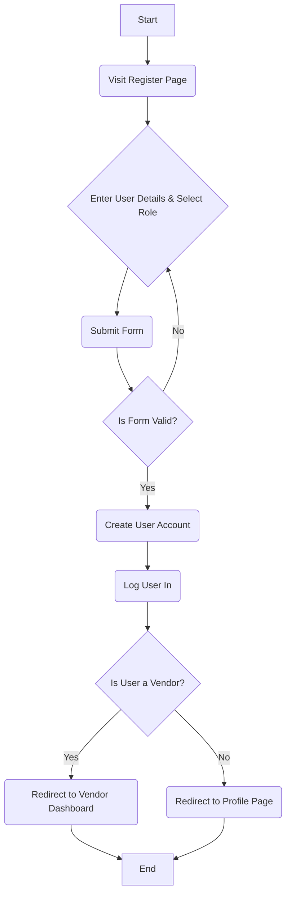
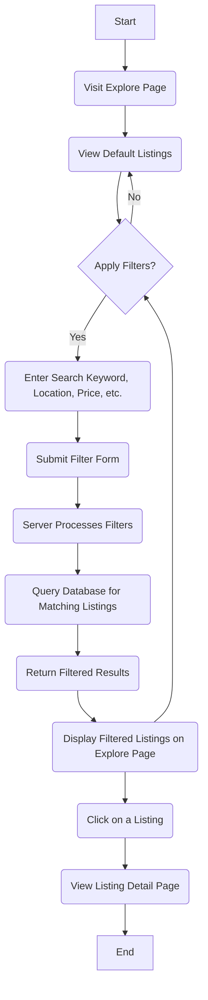

# Activity Diagrams

This document provides activity diagrams for key user flows within the TasteLocal application. These diagrams illustrate the sequence of actions and decisions for processes like user registration, booking, and listing management.

## 1. User Registration

This diagram shows the process for a new user registering an account.



## 2. Tourist Booking an Experience

This diagram illustrates the flow for a tourist booking a food experience.

```mermaid
graph TD
    A[Start] --> B(View Experience Detail Page)
    B --> C(Select Date & Guests)
    C --> D(Click "Book Now")
    D --> E{Is User Logged In?}
    E -- No --> F(Redirect to Login Page)
    F --> B
    E -- Yes --> G{Is User a Tourist?}
    G -- No --> H(Show "Vendors cannot book" message)
    H --> Z[End]
    G -- Yes --> I(Proceed to Payment Page)
    I --> J(Confirm Payment Details)
    J --> K(Process Payment)
    K --> L(Create Booking Record in Database)
    L --> M(Redirect to Confirmation Page)
    M --> Z[End]
```

## 3. Vendor Creating a New Dish Listing

This diagram shows the process for a vendor adding a new dish to their shop.

```mermaid
graph TD
    A[Start] --> B(Navigate to Vendor Dashboard)
    B --> C(Click "Add New Dish")
    C --> D{Is User a Vendor?}
    D -- No --> E(Redirect to Home Page)
    E --> Z[End]
    D -- Yes --> F(Display "Add Dish" Form)
    F --> G(Enter Dish Details and Upload Image)
    G --> H(Submit Form)
    H --> I{Is Form Valid?}
    I -- No --> F
    I -- Yes --> J(Create Dish Record in Database)
    J --> K(Associate Dish with Vendor's Shop)
    K --> L(Redirect to Vendor Dashboard)
    L --> Z[End]
```

## 4. Tourist Searching and Filtering Listings

This diagram outlines the steps a tourist takes to find a specific listing on the Explore page.


