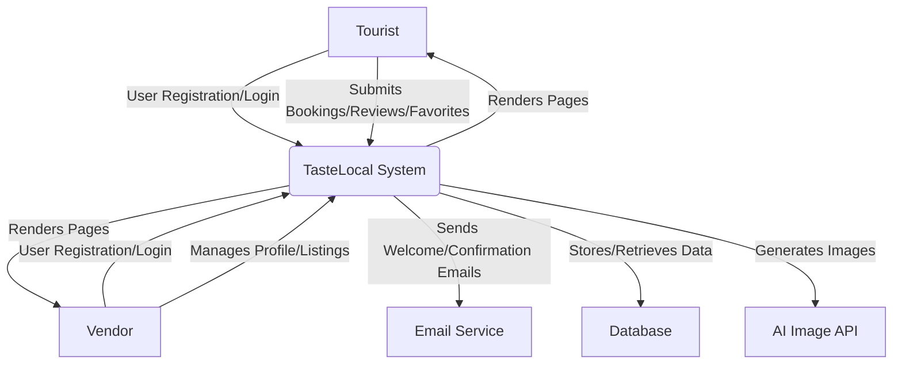

# Data Flow Diagram (DFD)

This document illustrates the flow of data within the TasteLocal application. The diagram shows how users (Tourists and Vendors) interact with the system and how data is processed and stored.

## Level 0 DFD: System Context

This diagram shows the overall context of the system, including the main external entities and the system itself as a single process.



## Level 1 DFD: System Processes

This diagram breaks down the main system into its core processes and shows how data flows between them.

```mermaid
graph TD
    subgraph User
        A[Tourist]
        V[Vendor]
    end

    subgraph TasteLocal System
        P1[User Management]
        P2[Listing & Search]
        P3[Booking & Reviews]
        P4[Vendor Dashboard]
    end

    subgraph Data Stores
        DS1[User Accounts]
        DS2[Listings (Shops, Dishes, Experiences)]
        DS3[Bookings & Reviews]
    end

    A -- Registers/Logs In --> P1
    V -- Registers/Logs In --> P1
    P1 -- Creates/Authenticates User --> DS1

    A -- Searches/Views Listings --> P2
    P2 -- Retrieves Listing Data --> DS2
    P2 -- Displays Listings --> A

    A -- Makes Booking/Leaves Review --> P3
    P3 -- Stores Booking/Review Data --> DS3
    P3 -- Retrieves Listing Data for Context --> DS2
    P3 -- Displays Confirmation/Review --> A

    V -- Accesses Dashboard --> P4
    P4 -- Authenticates via User Data --> DS1
    P4 -- Manages Listings (CRUD) --> DS2
    P4 -- Views Bookings --> DS3
    P4 -- Renders Dashboard UI --> V
```

### Key Data Flows

*   **User Registration:** Tourists and Vendors provide their details to the `User Management` process, which creates an account in the `User Accounts` data store.
*   **Searching:** Tourists send search queries to the `Listing & Search` process, which retrieves data from the `Listings` data store and displays the results.
*   **Booking:** Tourists submit booking requests through the `Booking & Reviews` process, which stores the booking information in the `Bookings & Reviews` data store.
*   **Vendor Management:** Vendors interact with the `Vendor Dashboard` to create, update, and delete their listings, which are stored in the `Listings` data store. They also view their incoming bookings, which are retrieved from the `Bookings & Reviews` data store.
