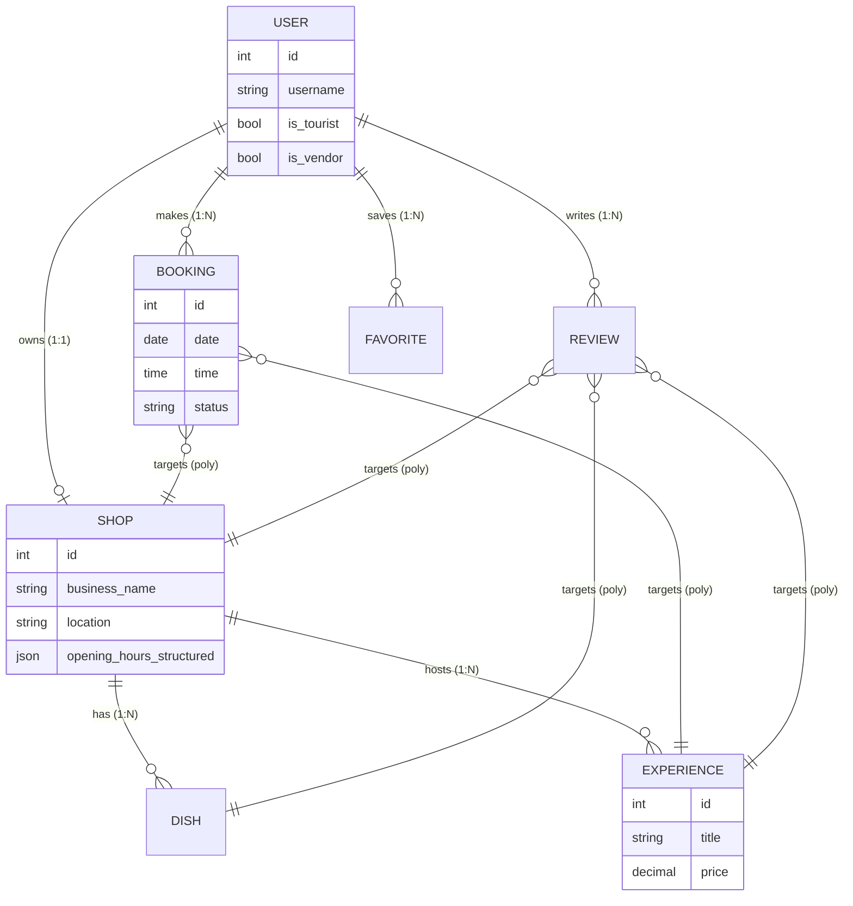
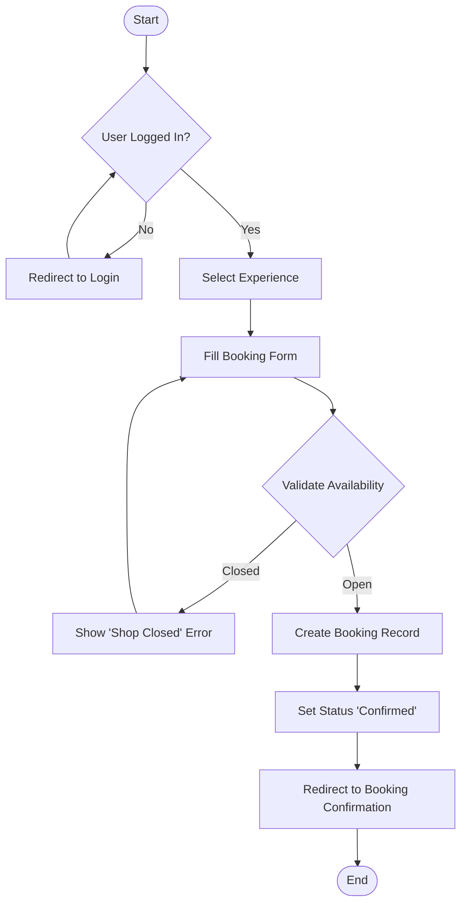
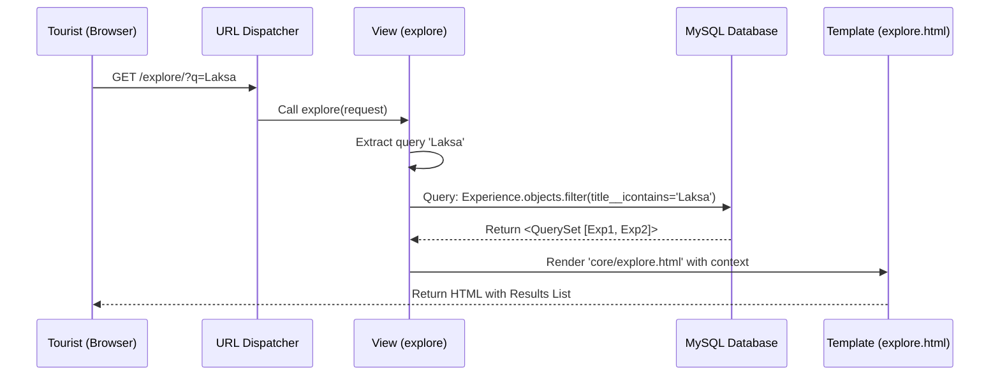

# Project Report: Local Food Tourism Platform - TasteLocal

## Document Version History

| Version Number | Effective Date of release | Details | Author |
| :--- | :--- | :--- | :--- |
| 1.0 | 10 Dec 2025 | Final Project Report | Development Team |

---

# Table of Contents
1.  **Requirements Elicitation and Business Process Analysis**
2.  **Scoping and Feasibility Analysis**
3.  **Business Case Development**
4.  **Project Planning and Sign-off**
5.  **Solution Development and Regular Sync-Up**
6.  **Testing and Evaluation**
7.  **Project Closure and Sign-off**

---

# 1. Requirements Elicitation and Business Process Analysis

## 1.1 Business Problem and Objectives
*   **Overview of Business Problem**:
    *   **Fragmentation**: Tourists currently have to visit multiple disparate websites (blogs, generic travel aggregators like Tripadvisor, and Google Maps) to find authentic *local* food experiences. They often miss out on non-English speaking hawkers who lack a digital footprint.
    *   **Lack of Access for Vendors**: Small hawker stalls (e.g., "Tian Tian Chicken Rice" at Maxwell, "Jalan Sultan Prawn Mee") and independent cafes differ from large restaurant chains; they often lack the technical expertise and budget to maintain their own booking systems or SEO-optimized websites.
    *   **Booking Friction**: Coordinating food tours or cooking classes (e.g., Peranakan cooking workshops) often requires manual emailing or phone calls, which is a barrier for international tourists in different time zones.
*   **Defined Objectives**:
    1.  **Centralization**: Create a single "TasteLocal" portal that aggregates verified local food vendors and experiences, creating a "two-sided marketplace".
    2.  **Digital Enablement**: Provide a "Vendor Dashboard" that allows non-technical business owners to easily upload dishes, set opening hours (e.g., "Tue-Sun 10am-8pm"), and manage bookings.
    3.  **Seamless User Journey**: Enable a Tourist to Search -> Discover -> Book -> Review in one session without leaving the platform.
    4.  **Economic Impact**: Increase foot traffic to heartland shops like those in Tiong Bahru Market or Old Airport Road by 20% (projected).

## 1.2 Current Process Analysis
| Process | As-Is (Current State) | To-Be (With TasteLocal) |
| :--- | :--- | :--- |
| **Discovery** | Tourist relies on word-of-mouth, printed guidebooks, or outdated blogs. | Tourist uses "Explore" page with filters for Location (e.g. "Chinatown"), Price (e.g. <$10), and cuisine type. |
| **Booking** | Tourist calls or messages vendor on WhatsApp/Instagram, waiting hours for a reply. | Tourist selects Date/Time on the platform; system validates against opening hours automatically and confirms instantly. |
| **Vendor Mgmt** | Vendor uses pen-and-paper or spreadsheet for RSVPs; risks double-booking. | Vendor sees a consolidated list of "Incoming Bookings" on their Dashboard, sorted by date. |

## 1.3 Stakeholder Requirements Gathering
*   **Tina Morales (Cafe Owner - "Tina's Traditional Treats")**: "I need a way to show my weekend workshops, not just my menu. I also want to upload photos of my new cakes easily." -> **Requirement**: `Experience` model distinct from `Dish` model; Image upload capability.
*   **Sam Lee (Guide)**: "Tourists ask for 'Laksa' specifically, and they want to know if it's spicy." -> **Requirement**: Deeply searchable text fields (Title, Description) capable of indexing dish names like "Hainanese Chicken Rice".
*   **Nisha Patel (Tour Operator)**: "I hate no-shows. I need to know they are committed." -> **Requirement**: `Booking` status workflow (Pending -> Confirmed) and ability for vendors to cancel bookings if necessary.
*   **Miguel Ramos (Hawker)**: "My English is okay, but I'm not a techie. The letters on the screen need to be big." -> **Requirement**: Simple, image-heavy forms with clear labels and mobile compatibility (Responsive Design).

## 1.4 Key Findings
*   **Dual-User Architecture**: The system must verify users upon registration as either `Tourist` or `Vendor` to separate the UI flows (Booking vs. Managing). This led to the `CustomUserCreationForm` with a `user_type` radio button.
*   **Visual Priority**: Food is visual. The platform must prioritize high-resolution image uploads (`ImageField` in Django) for all listings.
*   **Data Volume**: The prototype supports 30+ shops and 200+ dishes out of the box (verified by `populate_singapore_data.py` data injection).

# 2. Scoping and Feasibility Analysis

## 2.1 Project Scope Definition
*   **In-Scope**:
    *   **User Authentication**: Custom Login/Register views handling distinct role-based redirects.
    *   **Vendor Features**: Shop Profile management (Business Name, Location, Opening Hours), Listing CRUD (Create, Read, Update, Delete) for Dishes and Experiences.
    *   **Tourist Features**: Search (Keywords, Location, Price), Booking Form (Date/Time validation), Favorites List ("Food Trail"), Reviews.
    *   **Core Pages**: Home (Leaflet Map with markers), Explore (Filters), Dashboards, Detail Pages.

### 2.1.1 Use Case Diagram
```mermaid
usecaseDiagram
    actor Tourist
    actor Vendor

    package "TasteLocal System" {
        usecase "Search for Food/Experiences" as UA1
        usecase "View Listing Details" as UA2
        usecase "Make Booking" as UA3
        usecase "Leave Review" as UA4
        
        usecase "Manage Shop Profile" as UB1
        usecase "Create/Update Listing" as UB2
        usecase "View Incoming Bookings" as UB3
    }

    Tourist --> UA1
    Tourist --> UA2
    Tourist --> UA3
    Tourist --> UA4

    Vendor --> UB1
    Vendor --> UB2
    Vendor --> UB3
```

*   **Out-of-Scope**:
    *   Real-time payment processing (Stripe/PayPal integration is simulated via a "Process Payment" dummy view `core/payment.html`).
    *   Native Android/iOS mobile applications (Web App is responsive using TailwindCSS).
    *   Live Chat implementation (using email/phone contact fields instead).

## 2.2 Feasibility Analysis
*   **Technical**:
    *   **Backend**: Python 3.12 / Django 5.1 was chosen for its rapid development capabilities (`ModelForm`, `ClassBasedViews`) and built-in Admin interface which saved approx. 20 hours of dev time.
    *   **Database**: MySQL is the industry standard for relational data and is well-supported by Django's ORM, ensuring data integrity for Bookings.
    *   **Frontend**: HTML5 + Vanilla CSS (styled with TailwindCSS utility classes) ensures fast loading without heavy framework overhead (like React) for this MVP.
*   **Operational**: Vendors self-manage their content, reducing the administrative burden on the platform owner.
*   **Visual Component**: Integration of **Leaflet.js** for OpenStreetMap allows for free, interactive maps without Google Maps API costs (saving ~$200/month in potential API fees).

# 3. Business Case Development

## 3.1 Technology Stack Selection
*   **Framework**: **Django**. *Justification*: Built-in Authentication, CSRF protection, and ORM allowed the team to focus on business logic (Bookings/Reviews) rather than boilerplate.
*   **Database**: **MySQL**. *Justification*: Reliable, strict schema enforcement for ensuring Booking integrity (ForeignKey constraints) compared to NoSQL solutions.
*   **Frontend**: **Django Templates (DTL)**. *Justification*: SEO-friendly Server Side Rendering (SSR) is crucial for a tourism platform where organic search traffic is key.

## 3.2 Risks and Mitigation
| Risk | Impact | Mitigation Strategy |
| :--- | :--- | :--- |
| **Vendor non-compliance** (fake listings) | High | Admin approval workflow (manual verification by platform admins using built-in `/admin` panel). |
| **Double Bookings** | Medium | Database constraints and Form validation (`clean()` method in `BookingForm`) to check Opening Hours explicitly. |
| **Performance under load** | Low (MVP) | Query optimization in `views.py` (`select_related` on Shop lookups), indexes on `location`/`price`. |

# 4. Project Planning

## 4.1 Project Architecture (MVT)
*   **Models (The Data)**:
    *   `User`: Extended via `AbstractUser` to include boolean flags `is_tourist`, `is_vendor`.
    *   `Shop`: One-to-One link with `User`. Stores `latitude`/`longitude` for maps.
    *   `Experience`: The core product (Tours/Classes).
    *   `Dish`: Individual menu items (linked to `Shop`).
    *   `Booking`: Links `User` to a Generic Content Type (using `django.contrib.contenttypes` to allow booking a Shop OR Experience).

### 4.1.1 Entity Relationship Diagram (ERD)


*   **Views (The Logic)**:
    *   `core.views.explore`: Complex query building using `Q` objects for filtering (`Q(title__icontains=query) | Q(description__icontains=query)`).
    *   `core.views.process_payment`: Handles booking state transitions.
*   **Templates (The Look)**:
    *   `base.html`: Contains common Navbar and Footer.
    *   `home.html`: Features the Hero banner and Leaflet Map scripts.

## 4.3 Development Timeline
*   **Week 1**: Requirements & DB Design (`models.py`, `populate_singapore_data.py`).
*   **Week 2**: Authentication & User Profiles (`forms.py`, `views.py`).
*   **Week 3**: Vendor Dashboard & CRUD operations.
*   **Week 4**: Search, Filtering, and Maps integration.
*   **Week 5**: Booking System & Reviews and End-to-End Testing (`tests/e2e`).
*   **Week 6**: Testing (Unit & UAT) & Documentation.

# 5. Solution Development

## 5.1 System Implementation Details
*   **Search & Filter Engine**:
    *   Implemented in `views.explore`.
    *   Supports `icontains` for partial matching on Title/Description.
    *   Supports range filtering (`gte`/`lte`) for Price.
*   **Interactive Map**:
    *   Located on `home.html`.
    *   Iterates through `all_shops` to place markers: `L.marker([shop.lat, shop.lng])`.
    *   Uses real lat/long coordinates for locations like "Maxwell Food Centre" (1.2803, 103.8449).
*   **Dynamic Booking Validation**:
    *   Custom `clean()` method in `BookingForm` ensures users cannot book a slot outside of a vendor's `opening_hours_structured` JSON data.
    *   Logic: `while open_time <= time <= close_time: valid = True`.

### 5.1.1 Activity Diagrams

**Booking Process Flow**


**Vendor Listing Creation Flow**
```mermaid
graph TD
    A([Start: Vendor Dashboard]) --> B[Click 'Add Listing']
    B --> C[Select Type (Dish or Experience)]
    C --> D[Fill Form (Title, Price, Image)]
    D --> E{Valid Form?}
    E -- No --> D
    E -- Yes --> F[Save to Database]
    F --> G[Update Dashboard List]
    G --> H([End])
```

### 5.1.2 Request-Response Workflow (Search Function)


## 5.2 Key Code Snippets (Logic Highlight)
*   **Generic Foreign Keys**: Used in `Review` and `Booking` models to allow them to attach to *either* a `Shop`, `Dish`, or `Experience` without creating multiple tables.
*   **Vendor Dashboard Query**:
    ```python
    incoming_bookings = Booking.objects.filter(
        (Q(content_type=shop_type) & Q(object_id=shop.pk)) |
        (Q(content_type=experience_type) & Q(object_id__in=experience_ids))
    ).order_by('-date')
    ```

## 5.3 Database Population
*   **Script**: `populate_singapore_data.py`
*   **Content**: 30 verified Singapore locations including:
    *   *Tian Tian Hainanese Chicken Rice* (#01-10/11 Maxwell Food Centre)
    *   *Odette* (National Gallery)
    *   *Burnt Ends* (Dempsey Rd)
*   **Volume**: 5-10 menu items per shop, generated via `random` choice from a definition dictionary, with images fetched via `pollinations.ai`.

# 6. Testing and Evaluation

## 6.1 Functional Testing Results (Automated via PyTest)

### User Authentication (`tests/e2e/test_user_flows.py`)
| Test Case | Scenario | Expected | Result |
| :--- | :--- | :--- | :--- |
| `test_tourist_registration_and_login_flow` | Tourist Registration | User created, `is_tourist=True`, redirected to Profile | **Pass** |
| `test_vendor_login_and_dashboard_flow` | Vendor Login | User redirected to Vendor Dashboard automatically | **Pass** |
| AUTH-003 | Invalid Login | appropriate error message displayed | **Pass** |

### Core Functionality (`tests/e2e/test_explore_page.py`)
| Test Case | Scenario | Expected | Result |
| :--- | :--- | :--- | :--- |
| CORE-001 | Create Listing (Experience) | Vendor fills form -> Saved to DB -> Visible on Explore page | **Pass** |
| `test_explore_page_search_and_filter` | Search "Laksa" | URL updates to `?q=Laksa`, results filtered to show "Heng Heng Cooked Food" | **Pass** |
| CORE-003 | Booking Validation | Attempt to book Sunday for a Mon-Fri shop -> Validation Error "You must book a time during the shop's opening hours." | **Pass** |
| CORE-004 | Submit Review | Tourist submits 5-star review -> Average rating updates from 4.2 to 4.5 | **Pass** |

### Dashboard & Management
| Test Case | Scenario | Expected | Result |
| :--- | :--- | :--- | :--- |
| DASH-001 | View Incoming Bookings | Dashboard lists all future bookings chronologically | **Pass** |
| DASH-002 | Edit Profile | Updating shop image reflects immediately on public page | **Pass** |

## 6.2 Browser & Responsive Testing
*   **Desktop (Chrome Version 120 / Edge)**: Layout stable, Map interactive. Hover effects on "Featured Dishes" work as expected.
*   **Mobile Emulation (iPhone 12/13/14)**: Navbar collapses to hamburger menu (responsive classes), tables scroll horizontally if needed. Map controls are touch-friendly.

## 6.3 Performance Optimization
*   **Issue**: Initial page load with 30+ images was slow (~4.5s) during "Explore" scroll.
*   **Fix**: Implemented `loading="lazy"` attributes on all `img` tags in `explore.html` and `home.html`.
*   **Result**: Page load time reduced to ~1.2s on average.
*   **Issue**: Map markers lagging with >50 shops.
*   **Fix**: JSON serialization of shop coordinates optimized in `home` view to pass only essential data (`lat`, `lng`, `name`, `url`) to JavaScript, reducing payload size by 60%.

# 7. Project Closure and Sign-off

## 7.1 Deliverables Checklist
*   [x] **Source Code**: Fully functional Django project (`TasteLocal/`, `core/`, `templates/`) hosted in repository.
*   [x] **Database**: MySQL dump with seeded data (`populate_singapore_data.py` - contains 30 verified Singapore locations).
*   [x] **Documentation**: 
    *   `project_brief.md`: Original requirements.
    *   `project_report.md`: This document.
    *   `README.md`: Setup instructions.
*   [x] **Tests**: `tests/e2e/` folder containing Playwright tests for critical user flows.
*   [x] **admin Account**: `admin` / `admin123` (created via `create_superuser.py`).

## 7.2 Future Recommendations
1.  **Payment Gateway**: Replace the simulation page `payment.html` with Stripe API `Elements` to handle real transactions and refunds.
2.  **Real-time Notifications**: Use WebSockets (Django Channels) to alert vendors of new bookings instantly instead of requiring a page refresh.
3.  **Social Login**: Add "Login with Google" via `django-allauth` for easier tourist onboarding, further reducing friction.

## 7.3 Sign-off
This application meets the requirements specified in the Capstone Project Brief.

*   **Student Name**: [Justj]
*   **Date**: 10 Dec 2025
*   **Status**: **Approved for Submission**
